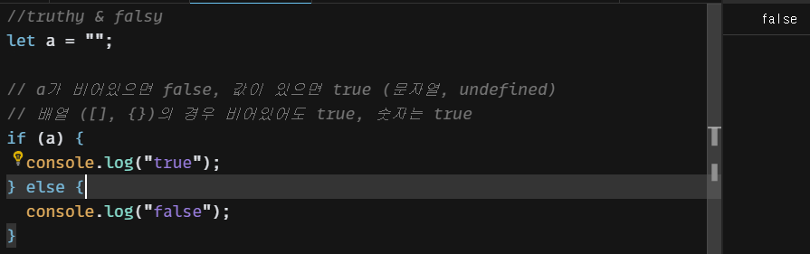

# JS 응용

- Truthy & falsy
    - if문에 조건식을 넣지 않아도 JS가 특정 기준으로 값을 참거짓을 판단
        - false : “”, undefined, null, 0, NaN / true : [], {}, 값이 있는 숫자, “a” 문자열
            
            
            
    - 활용법
        - 객체 undefined 확인
            
            
            

- 삼항 연산자
    - if문 형태를 줄여서 표현하는 연산자
        
        
        
    - truthy & falsy
        
        
        
    - 조건이 여러개인 경우
        - 가독성이 떨어져 다수의 조건인 경우 if문 사용 권장
        
        
        
    
- 단락회로 평가
    - 논리 연산자의 특성을 이용한 문법 (예 : true && false, true || true, !true)
        - true && false : false 반환 / true && true : 뒤true 반환 / flase && false : 앞false 반환
        - true || true : 앞true 반환 / true || false : 앞true 반환 / false || false : 뒤false 반환
    - Truthy & falsy 이용한 단락회로
        
        
        
        person값이 이미 false 이기 때문에 논리연산자 결과(false)에 따라 undefined가 나온다
        
        
        
        person이 true이기에 단락회로 평가에서 ‘이정환’ 출력
        

- 조건문 업그레이드
    - 배열을 이용한 조건 - 단일 파라미터에 여러 조건이 붙는 경우
        
        
        
    - 다수 조건에 따라 다른 결과를 배출하는 경우
        
        
        

- 비 구조화 할당
    - 배열이나 객체에서 원하는 값을 쉽게 추출하는 방법
        
        
        
        
        
        배열 안에 변수를 선언해서 매핑
        
    - 할당받지 못한 배열 속 변수에 기본값 설정
        
        
        
    - swap : 두 개의 변수 값을 서로 바꿈
        
        
        
    - 객체의 비구조 할당 - key 값을 기준으로 할당
        
        
        
        
        
        key 값의 변수명을 변경하고 싶을 때
        
- Spread 연산자 - 속성 부분을 …으로 묶어서 펼쳐주는 연산자
    
    
    
    
    

- 동기 & 비동기
    - 동기 방식
        - 작성된 코드 순서대로 작업을 처리함 (thread가 1개)
        - 다음 작업은 이전 작업이 끝날 때까지 수행하지 않고 기다림 (블로킹 방식)
        - 문제점 : 수행시간이 오래걸리는 작업이 존재 시, 모든 작업이 종료되기까지 전반적인 흐름이 느려짐
        - 해결법 : Multi Thread 방식 사용 (But JS는 Single Thread만 존재)
    - 비동기 방식
        - 싱글 쓰레드 방식을 이용하면서, 동기적 작업의 단점을 극복하기 위해 여러개 작업을 동시에 실행
        - 작업이 정상적으로 수행했는지 확인하기 위해, 작업 끝에 콜백 함수를 붙여서 전달
            
            
            
        - 코드
            
            
            
    - JS Engine
        - 자바스크립트로 작성한 코드들은 웹브라우저에 탑재되어 있는 자바스크립트 엔진을 이용해서 해석되고 실행
        - 자바스크립트 엔진은 ‘힙’과 ‘콜스택’ 두 가지 구성요소로 이루어짐
            - 힙 : 변수나 상수들의 사용되는 메모리를 저장하는 영역
            - 콜스택 : 작성한 코드의 실행에 따라서 호출스택이라는 것을 쌓는 영역
        - 자바스크립트가 실행되면 최상위 문맥 Main Context가 콜스택에서 실행하고 이 Main Context가 콜스택에서 나가는 순간이 프로그램이 종료되는 시점이다
            
            쌓인 스택은 들어온 순서의 역순으로 빠져나간다
            
        - 자바스크립트는 콜스택이 하나이기 때문에 Thread가 1개임
        - 비동기 방식의 콜스택
            
            
            
            
            
            
            
            
            
            
            
            이후 cb과 Main Context가 순차적으로 나감
            
    - 콜백지옥
        
        
        
        - 해결법 : 비동기 담당 객체(Promise) 사용
- Promise - 콜백 지옥에서 탈출
    - 비동기가 가질수 있는 3가지 상태
        - Pending(대기상태) : 비동기 작업이 진행 중이거나 무언가 문제가 있는 상태
        - Fulfilled(성공) : 비동기 작업이 정상적으로 마친 상태
        - Rejected(실패) : 비동기 작업이 어떠한 이유로 실패한 상태(서버 무반응, 타임아웃 등)
    - 코드
        
        
        
    - 응용
        
        
        
    - Promise 장점
        
        
        
        중간에 작업을 끼워 넣을 수 있다
        
    
- async & await - 직관적인 비동기 처리 코드 작성
    - async : 함수를 Promise로 자동 반환하는 비동기 처리 코드
        
        
        
    - await : 비동기 함수에 붙일 경우 마치 동기 처리처럼 동작해서 작업이 수행될 때까지 다음 동작을 하지 않는다 (async와 같이 사용됨)
        
        
        

- API 호출
    - Application Programming Interface - 응용프로그램 프로그래밍 인터페이스
    - 응용프로그램에서 사용할 수 있도록 운영체제나 프로그래밍 언어가 제공하는 기능을 제어할 수 있게 만든 인터페이스를 뜻함
        
        
        
    - API 호출은 사용자 환경에 따라 처리시간이 상이하므로 동기방식이 아닌 Promise 객체를 이용한 비동기방식을 사용한다.
    - fetch : 자바스크립트에서 api를 호출할 수 있도록 해주는 내장함수
    - 호출(기본)
        - 응답은 포장지 형태의 상태값으로 출력 (추출 필요)
            
            
            
    - async & await을 이용한 호출
        
        
        
    -