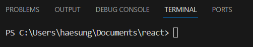

# Node.js 기초

※ JS파일을 node.js로 실행시켜보기 위해 터미널이 필요

- 터미널
    
    사용자가 운영체제(OS)에 명령을 내리는 방법에 GUI와 CLI 방식이 있다
    
    GUI (Graphic User Interface) : 그래픽 기반으로 마우스 클릭만으로 명령을 내릴 수 있는 방식
    
    CLI (Command Line Interface) : 명령어를 입력해서 운영체제에 명령을 내리는 방식
    
    - 터미널이란 명령어를 입력해서 운영체제에 명령을 내릴 수 있도록 하는 공간
    - ‘Node’ 명령어로 index.js를 node프로그램으로 실행시킬 수 있다
    
- 실행 방법
    
    
    
- 모듈로 내보내기
    - 기능을 가진 js 파일은 모듈이 되며 내보내기를 통해 외부에서도 사용 가능
        
        
        
        module.exports : 내보내고 싶은 기능을 모듈로 묶음 (node.js 전용 내장함수)
        
        require : 경로에 해당하는 모듈을 불러옴 (node.js 전용 내장함수)
        
        
        
        ※ 불러온 모듈 내 기능을 사용
        
    - CommonJS : module.exports으로 내보내고 require로 불러오는 node.js의 모듈 시스템
        
        (그 밖에 ES Module 이라는 모듈 시스템도 존재)