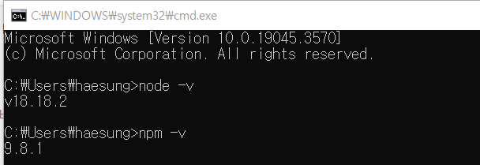

# Node.js 정의 및 설치

## 유래

- 웹브라우저마다 가지고 있는 엔진이 존재
- 크롬에서 사용되는 ‘V8’ 엔진이 대표적인 자바스크립트 엔진
    - V8엔진은 브라우저에서 독립적으로 사용이 가능
    
          → 어디서든 사용가능한 언어로 개발추진 (Node.js)
    

## 특징

- Node.js는 JS의 실행환경이라 부르며 JS의 런타임이라고도 부른다
- JS 코드를 브라우저 없이 우리 컴퓨터에서도 실행 가능
- JS가 브라우저에서 벗어나 독립적으로 사용가능
    - JS를 이용해서 PC프로그램을 생성함
    - 웹서버 만들 수 있음
        - 웹서버 : 브라우저가 웹을 요청하면 웹을 반환해주는 서버
            
            웹 : HTML + CSS + JS
            
- React와 연관성 : 여러가지 기능을 가진 JS파일들을 쉽게 만듬
    - React로 만들어진 JS파일들은 여러기능을 웹브라우저에 전달되어서 고전적인 웹사이트가 아닌 프로그램처럼 동작 (웹 어플리케이션 OR 리액트 어플리케이션)
- React의 기반이 되는 언어

## Node.js & VsCode 설치 및 환경설정

- Node.js 설치 - 구글 검색 후 Node.js 사이트에서 버전에 맞는 파일 설치
- 정상설치 확인
    
    
    
    npm : node package manager
    

- VSCODE (Visual Studio Code) - JS 에디터
    - 소스코드를 쉽게 편집하고 저장, 실행하는 개발도구
    - 근본적으로 파일이나 폴더를 관리하고 소스코드를 수정하는데 초점
    - 기능들을 파일별로 저장하는 루트폴터를 지저하고 관리
- VsCode 설정
    - 저장 시, 자동 정렬
        
        
        
        - ctrl + shift + p : show all command
            
            
            
            prettier를 제대로 사용하기 위한 설정 (Open Settings (UI))
            
            
            
            Format On Save 클릭
            
    - extension : 소스코드를 작성할 때 유용하게 쓰이는 기능을 확장 설치할 수 있음