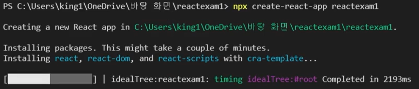

# React 기초

Node.js 기반의 Javascript UI 라이브러리

- 리액트는 Component 기반의 UI 라이브러리 (동일한 문제로 여러 파일 수정 불필요)
- 선언형 프로그래밍
    
    명령형 프로그래밍처럼 절차를 다 나열하는 것이 아닌, 직설적으로 목적만을 수행
    
- Virtual DOM (가상 DOM)
    
    요소가 바뀔 때마다 웹페이지 실행 과정을 반복수행 하는 문제 발생
    

※ 리액트 라이브러리 패키지를 다운받아 바로 사용하기 힘들고 추가적인 라이브러리 설치가 필요

대표적인 라이브러리

- Webpack : 다수의 JS파일을 하나의 파일로 합쳐주는 모듈 번들 라이브러리
- Babel : JSX 등의 쉽고 직관적인 JS 문법을 사용할 수 있도록 해주는 라이브러리

하나하나 필요한 라이브러리를 찾아 설치하는 것은 비효율적임

- 필요한 라이브러리 세팅이 완료된 패키지(패키지의 패키지)를 설치 - Boiler Plate
- 설치 방법
    
    
    
    프로젝트 명 설정 시, 소문자로 입력 (대문자 및 일부 특수기호 사용하면 에러 발생)
    
    ※ 설치 완료 후, 프로젝트 안에 새로운 폴더로 생성되므로 사용자 기호에 맞게 파일 위치 이동
    
    
    
    파일 구성은 node.js 기반이기 때문에 유사하다
    
    ※ js가 붙는 프론트엔드 프레임워크들은 대다수 위와 같은 구조를 가짐
    
- 리엑트 앱은 Node.js 기반 웹서버 위에서 동작
    
    서버를 띄우려면 패키지 script에 등록된 start 사용 / 서버에 띄운 앱을 종료 하려면 ctrl+c
    
- robots.txt
    
    사용자 웹사이트 정보 수집 (수집 : User-agent / 차단 : disallow)
    
    
    
- React는 함수를 만들고 retrun으로 JSX문법의 html을 반환해주면서 컴포넌트를 만들 수 있다
    
    
    
    함수 내보내기 - react는 ES모듈 시스템을 사용(단, export default는 1개만 내보낼 수 있음)
    
    
    
    
    
    가져오기 - import ‘모듈명’ from “파일경로”
    

## JSX

JS와 HTML을 합쳐서 사용할 수 있는 문법 - JavaScript Extension

- 특징
    - 버전에 따라 js 파일의 함수에 리턴값을 설정해 줘야 함

- 문법
    - 닫힘규칙
        
        
        
        태크들은 항상 닫아줘야 한다( 처럼 혼자 닫는 태그를 self-closing 태그라 함)
        
    - 최상위 태그 규칙
        
        가장 바깥에 있는 태그가 무조건 반환값을 묶어야 한다
        
        
        
        ※ div 태그가 없으면 MyHeader 묶지 못해 에러 발생
        
        
        
        최상위 태그를 두고 싶지 않으면 React.Fragment 태그로 묶음 또는 <></> 빈태그로 묶음
        

## JSX 및 CSS 결합

CSS 적용을 위해 사용되는 class는 JSX에서 스크립트 예약어로 이미 존재함으로 className으로 대체

CSS가 저장되어있는 경로를 import해서 CSS 내부 element를 className으로 호출

※(. → class, # → id, 없으면 태그)

- 인라인 스타일링 방식
    
    CSS파일을 사용하지 않고 디자인하는 방
    
    
    

## JSX 내에 값 불러오기

※ 단, 숫자나 문자열만 들어올 수 있다

- 응용 (조건부 렌더링)
    
    
    

## State (상태)

변화하는 특정 상태에 대해서 상태에 따라 각각 다른 동작을 하는 것

- 실습
    
    
    
    - Counter 컴포넌트는 자신의 상태인 count가 변할 때마다 Count 함수를 다시 호출하여 리렌더링 한다
    - 즉, 상태가 변화하는 부분만 다시 호출하여 효율성을 향상 시킬 수 있다
    - 또한 한 컴포넌트에 다중으로 상태를 가질 수 있다

## Props - 컴포넌트에 데이터 전달하는 방법

- 실습
    - Counter.js에 있는 초기값이 아닌 App.js에 있는 값으로 초기값을 설정
    - 변수명 설정해서 값을 넘겨준다 - Prop / 복수개를 넘기면 Props
        
        
        
        
        
    
    - 넘겨 받은 값을 props에 담는다 (props는 객체 타입)
        
        
        
        
        
    
    - 위 방법을 복수의 데이터를 넘기는 것은 비요율적
        
        데이터를 객체형태로 만들어서 Spread 연산자로 넘김
        
        
        
        비구조 할당을 통해 데이터 값을 추출 가능
        
        
        
    
    - 데이터를 넘기다가 실수로 값을 빠지는것을 방지하기 위해 초기값 설정
        
        초기값 설정 없이 전달 데이터가 없을 경우 NaN 버그 발생
        
        
        

- 동적인 데이터(state) 전달
    - 동적인 데이터 count를 OddEven 컴포넌트로 전달
        
        
        
        
        
    - 부모 컴포넌트 Counter가 리렌더링 되면 자식 컴포넌트인 OddEven도 같이 리렌더링 된다
    
- 컴포넌트 자체 전달
    - 컴포넌트 사이에 컴포넌트를 넣으면 안에 있는 컴포넌트가 Props가 된다
    
    
    
    
    
    - 결과
    
    